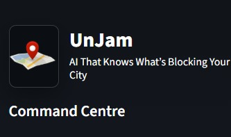
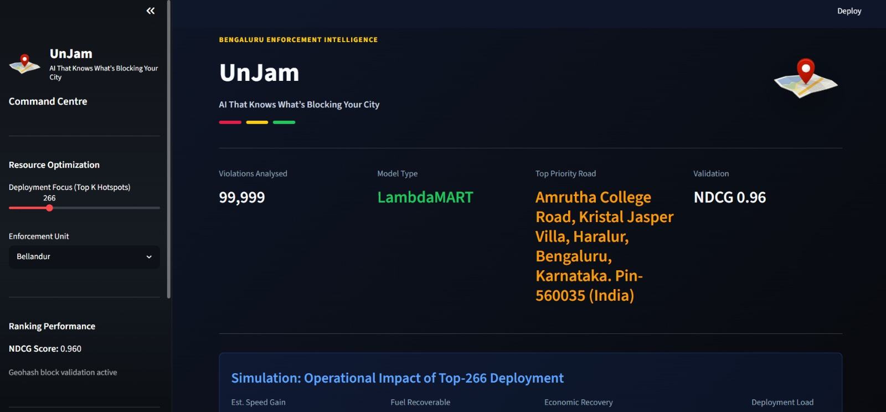
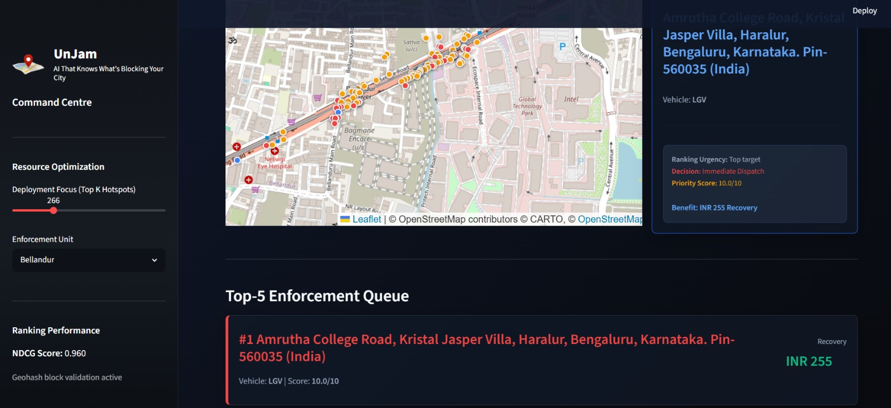
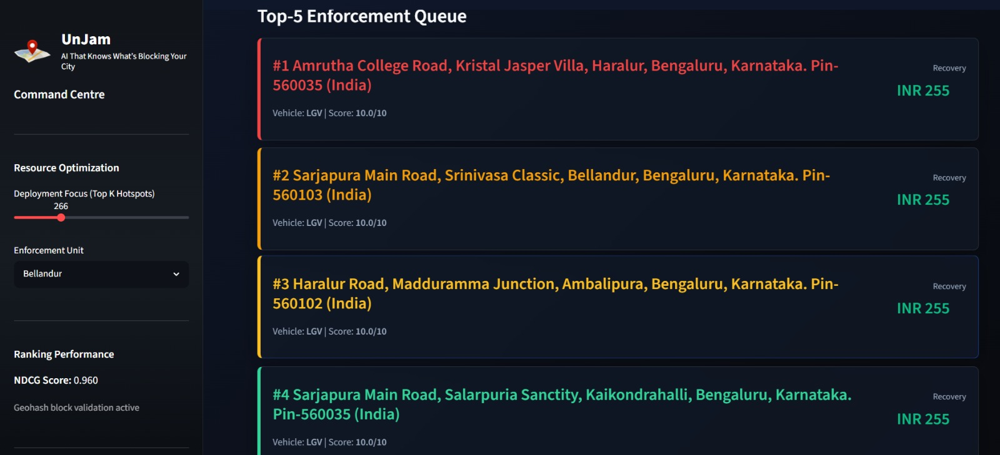
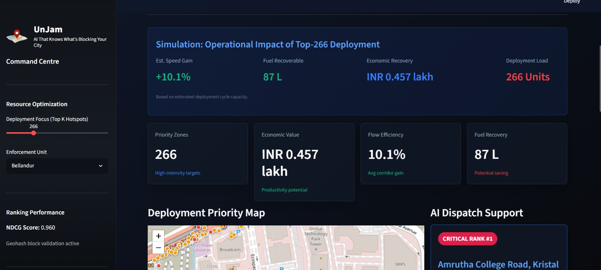

#  UnJam

## AI That Knows What’s Blocking Your City

UnJam is an AI-powered urban mobility intelligence platform that identifies which illegally parked vehicles are causing the highest congestion impact and helps traffic enforcement teams prioritize action.

Built for **GridLock Hackathon 2.0 by Flipkart and HackerEarth**.

---

##  Prototype Screenshots

###  Logo
<p align="center">
  
</p>

---

###  Dashboard
<p align="center">
  
</p>

---

###  Interactive Map View
<p align="center">
  
</p>

---

###  Priority Queue
<p align="center">
  
</p>

---

###  Impact Simulation
<p align="center">
  
</p>

##  Demo Video

👉 [Watch the Demo Video](https://drive.google.com/file/d/1gMyh90WYzPyg3IJ7GOZVqkfIGEUF2Un9/view?usp=sharing)

##  Problem

Illegal parking is not just a rule violation — it is a congestion multiplier.

A single wrongly parked vehicle can:

- Reduce effective road width
- Slow traffic flow
- Block emergency and public transport movement
- Increase fuel loss and travel delays
- Create enforcement overload without clear prioritization

Current systems often detect or record violations, but they do not answer the most important question:

> Which violation should be cleared first to unblock the city fastest?

---

##  Solution

UnJam transforms raw parking violation data into actionable enforcement intelligence.

It ranks illegal parking hotspots based on their real congestion impact using:

- Parking violation records
- Geohash-based spatial intelligence
- Time-based demand patterns
- Round 1 traffic demand model as a Digital Twin
- Learning-to-rank AI model
- Priority scoring
- Impact simulation
- Interactive command-centre dashboard

---

##  Digital Twin Intelligence

For this prototype, UnJam uses our validated Round 1 traffic demand model as a **Digital Twin of Bengaluru traffic**.

The model helps estimate demand pressure across:

- Geohash zones
- Time of day
- Road context
- Mobility pressure patterns

In production, this Digital Twin layer can be replaced with a live API feed from the Bengaluru Traffic Management Center.

---

##  How It Works

```text
Illegal Parking Violation Data
        ↓
Latitude/Longitude to Geohash
        ↓
Timestamp and Hour Extraction
        ↓
Merge with Round 1 Demand Model
        ↓
Feature Engineering
        ↓
Learning-to-Rank AI Model
        ↓
Priority Score Generation
        ↓
Dashboard + Dispatch Recommendation
```

##  AI Model

UnJam uses a **Learning-to-Rank** approach using an **XGBRanker / LambdaMART-style model**.

### Why ranking?

Because enforcement teams do not only need a prediction.

They need an **ordered action queue**.

The model learns urgency using:

- Location  
- Hour of day  
- Demand pressure  
- Vehicle type severity  
- Peak-hour multiplier  
- Police station grouping  
- Geospatial validation  

### Evaluation Metric

**NDCG — Normalized Discounted Cumulative Gain** 
**Achieved Score : 0.96**

---

##  Priority Score

Each hotspot receives a **normalized urgency score from 0 to 10**.

A higher score means:

- Higher congestion relevance  
- Higher demand pressure  
- More severe vehicle obstruction  
- Stronger enforcement priority  
- Higher expected recovery value  

### Example

```text
Priority Score: 9.8 / 10
Status: Immediate Dispatch Candidate
```


---

##  Dashboard Features

The **UnJam Command Centre** provides:

- Top-K hotspot selection  
- Police station filtering  
- CARTO Positron map view  
- Leaflet-based interactive map  
- Clustered hotspot markers  
- Priority-colored location pins  
- Top-5 enforcement queue  
- AI dispatch recommendation  
- Model performance score  
- Fuel recovery estimate  
- Economic recovery simulation  
- Flow efficiency estimate  

---

##  Map Intelligence

UnJam provides a **clean geospatial view of congestion pressure** using:

- CARTO Positron tiles  
- Leaflet interactive maps  
- Clustered hotspot visualization  
- Priority-colored markers  
- Popup-level hotspot details  

### Color Logic

```text
🔴 Red     → Critical Priority
🟠 Amber   → Medium-High Priority
🟢 Green   → Lower Priority
```

---

##  Impact Simulation

UnJam estimates the **value of enforcement before action is taken**.

For selected hotspots, it estimates:

- Speed gain  
- Fuel recoverable  
- Economic recovery in INR  
- Deployment load  
- Road-level priority  
- Benefit per hotspot  

Instead of saying:

> There are 100 violations.

UnJam says:

> These 100 targets can recover measurable time, fuel, and mobility value.

---

##  What Makes UnJam Different

| Traditional Systems | UnJam |
|---------------------|--------|
| Count violations | Rank congestion impact |
| Show static hotspots | Show demand-aware hotspots |
| Treat all violations similarly | Prioritize by real disruption |
| Manual dispatch decisions | AI dispatch support |
| Reactive enforcement | Impact-driven enforcement |
| No recovery estimate | Fuel and economic recovery simulation |

---

##  Future Scope

### 1. Live CCTV Integration 

Integrate with **live CCTV feeds** to:

- Detect illegally parked vehicles in real time  
- Compute congestion impact instantly  
- Continuously update enforcement priorities  

---

### 2. Citizen Reporting 

Allow citizens to upload:

- Photo  
- GPS location  
- Timestamp  

The AI estimates congestion impact before forwarding the complaint.

This creates **crowd-powered traffic intelligence**.

---

### 3. Dynamic Fine Recommendation 

Instead of fixed fines, the penalty amount depends on:

- Congestion caused  
- Duration of obstruction  
- Vehicle type  
- Repeat offender history  

### Example

```text
Normal Fine: ₹500

High-Impact Violation: ₹1500
```

This makes enforcement **impact-based rather than rule-based**.

---

### 4. Cloud Deployment 

Deploy on:

- AWS  
- Azure  
- GCP  

Benefits:

- Police headquarters and field officers access the same dashboard  
- Real-time synchronization across enforcement teams  
- Scalable city-wide deployment  

---

##  Tech Stack

```text
Frontend       → React / Streamlit / HTML-CSS-JS
Maps           → Leaflet + CARTO Positron
Model          → XGBRanker / LambdaMART
Data Processing→ Python, Pandas, NumPy
Geospatial     → Geohash + Latitude/Longitude Processing
Visualization  → Plotly / Dashboard UI
Deployment     → Local / Cloud-Ready
```

---

##  Project Structure

```text
UnJam/
│
│── Source Code/
│   │
│   ├── app.py
│   ├── UnJam.py
│   ├── feature_names.json
│   ├── final_urbanpulse_data.pkl
│   ├── ranker_model.pkl
│   ├── requirements.txt
│   └── metrics.json
│
│
│── Datasets.zip
│
│
├── assets/
│   ├── UnJam logo.jpeg
│
│
│── ss1.jpeg
│── ss2.jpeg
│── ss3.jpeg
│── ss4.jpeg
│── ss5.jpeg
│── ss6.jpeg
│── ss7.jpeg
│── ss8.jpeg
│
│
└── README.md
```

---

##  Getting Started

### 1. Clone the Repository

```bash
git clone https://github.com/IshaanMig2507/UnJam---AI-that-knows-what-s-blocking-your-city.git
cd UnJam---AI-that-knows-what-s-blocking-your-city
```

### 2. Create Virtual Environment

```bash
python -m venv venv
```

### 3. Activate Virtual Environment

**Windows**

```bash
venv\Scripts\activate
```

**macOS / Linux**

```bash
source venv/bin/activate
```

### 4. Install Dependencies

```bash
pip install -r requirements.txt
```

### 5. Ensure Required Files

Before running the application, make sure the following files are present in the project root:

- `final_urbanpulse_data.pkl`
- `ranker_model.pkl`
- `feature_names.json`
- `metrics.json`

### 6. Run the Dashboard

```bash
streamlit run app.py
```

---

##  Built For

**GridLock Hackathon 2.0**  
Organized by **Flipkart × HackerEarth**

---

##  Team

**Team:** VibelessCoders

- Ishaan Miglani
- Devang Garg

---

##  Tagline

> Cities do not need faster enforcement.  
> They need smarter enforcement.


